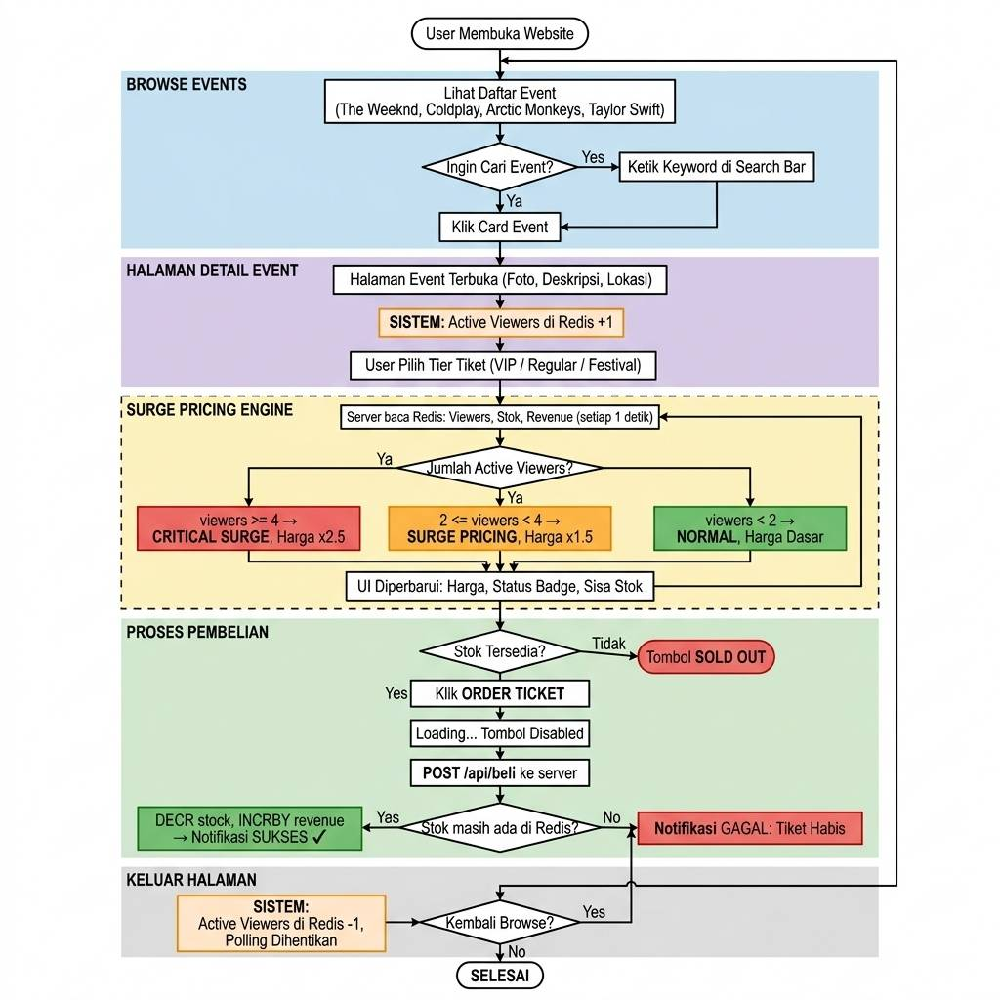
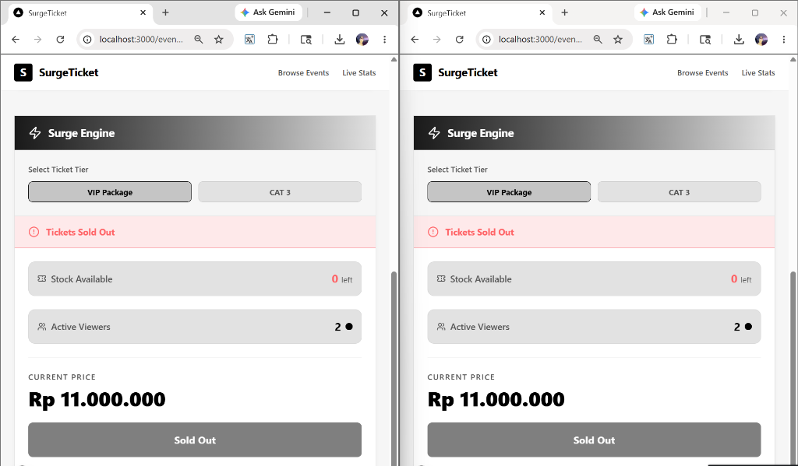
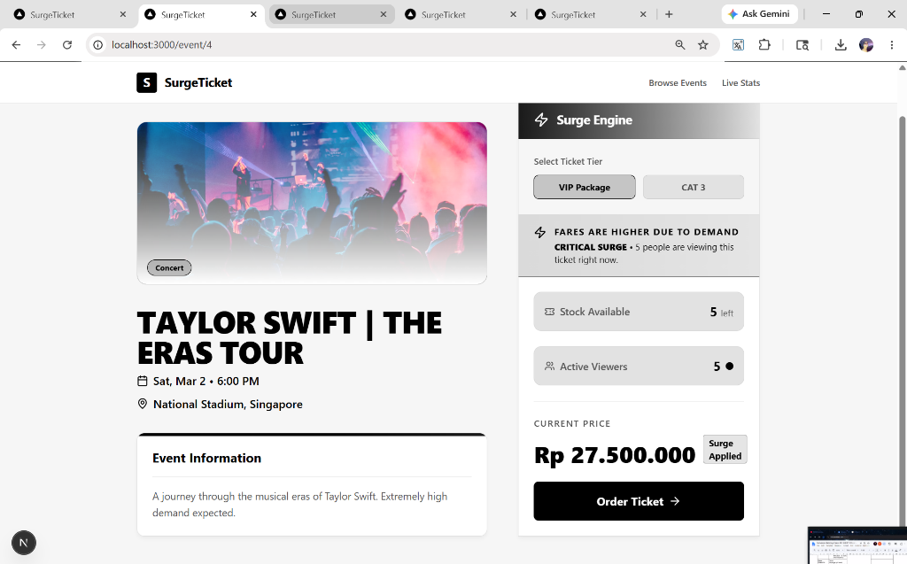
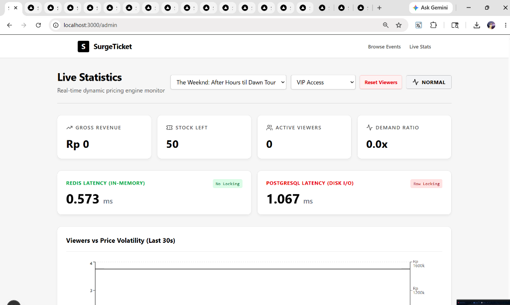

# SurgePricing

- Backend: Node.js + Express
- Database: Redis (key-value / hash paradigm)
- Port API: `3001` (http://localhost:3001)
- File penting:
	- `backend/server.js` — kode API dan logika surge pricing
	- `backend/seed.js` — seeder untuk membuat data event & tiket contoh
	- `backend/package.json` — dependensi (express, redis, bcryptjs, jsonwebtoken, cors)

## Flowchart



## Kontrak singkat (inputs / outputs)
- Input: request HTTP ke endpoint REST (JSON untuk registrasi/login; route params untuk event/ticket)
- Output: JSON berisi { success?, data?, message?, error? } atau objek status tiket (viewers, stok, harga, revenue, status)
- Error mode: server mengembalikan HTTP 4xx untuk request invalid dan 5xx untuk kesalahan server

## Model data (konvensi key di Redis)
Backend menggunakan pola key Redis yang sederhana dan mudah dibaca:

- Event sebagai Hash:
	- Key: `event:<eventId>` (hash)
	- Fields: `id`, `title`, `description`, `location`, `date`, `category`, `image`

- Daftar semua event:
	- Key (set): `events:all` — set berisi `eventId` string

- Ticket variation (per event) sebagai Hash:
	- Key: `ticket:<eventId>:<ticketId>` (hash)
	- Fields: `id`, `name`, `base_price`, `initial_stock`

- Stock / viewers / revenue / price disimpan sebagai string/number keys:
	- `ticket:<eventId>:<ticketId>:stock` (integer)
	- `ticket:<eventId>:<ticketId>:viewers` (integer)
	- `ticket:<eventId>:<ticketId>:revenue` (float)
	- `ticket:<eventId>:<ticketId>:price` (float) — disimpan saat kalkulasi status

Contoh isi setelah seeding (ringkasan):

 - `events:all` = { "1", "2", "3", "4" }
 - `event:1` = hash (title: "The Weeknd: After Hours til Dawn Tour", ...)
 - `ticket:1:vip` = hash (base_price: 1500000, initial_stock: 50)
 - `ticket:1:vip:stock` = "50"
 - `ticket:1:vip:viewers` = "0"
 - `ticket:1:vip:revenue` = "0"

## Ringkasan endpoint API
Semua path diawali `/api`.

- GET /api/events
	- Deskripsi: ambil daftar semua event (hash setiap event)
	- Response: { success: true, data: [ { eventHash }, ... ] }

- GET /api/events/:id
	- Deskripsi: ambil detail event + variasi tiketnya (tickets array)
	- Response: { success: true, data: { ...event, tickets: [ { id, name, base_price, initial_stock, current_stock }, ... ] } }

- GET /api/status/:eventId/:ticketId
	- Deskripsi: kalkulasi harga saat ini dan status tiket berdasarkan viewers, stock, revenue
	- Response: { viewers, stok, harga_sekarang, revenue, status }

- POST /api/masuk/:eventId/:ticketId
	- Deskripsi: increment viewers (dipakai saat user masuk ke halaman pembelian)
	- Response: { success: true, viewers }

- POST /api/keluar/:eventId/:ticketId
	- Deskripsi: decrement viewers (tidak turun di bawah 0)
	- Response: { success: true }

- POST /api/reset-viewers/:eventId/:ticketId
	- Deskripsi: admin utility untuk set viewers=0

- POST /api/beli/:eventId/:ticketId
	- Deskripsi: melakukan pembelian: decrement stock atomik, tambahkan revenue sesuai `ticket:<...>:price`
	- Response: { success: true|false, message }

- POST /api/register
	- Deskripsi: register user baru; body JSON: { username, email, password }

- POST /api/login
	- Deskripsi: login user; body JSON: { username, password } → mengembalikan JWT token

Contoh response (status ticket):

```json
{
	"viewers": 3,
	"stok": 120,
	"harga_sekarang": 750000,
	"revenue": 15000000,
	"status": "SURGE PRICING"
}
```

## Logika Surge Pricing (penjelasan implementasi)
Implementasi pada `GET /api/status/:eventId/:ticketId` melakukan:

1. Ambil `base_price` dan `initial_stock` dari hash tiket.
2. Hitung `TARGET_REVENUE = base_price * initial_stock`.
3. Baca nilai `viewers`, `stock`, `revenue` saat ini dari Redis.
4. Hitung `harga_target = (TARGET_REVENUE - revenue) / stok` (jika stok > 0).
5. Hitung `harga_demand` berdasarkan angka viewers — pada mode demo threshold ditetapkan statis:
	 - viewers >= 4 → harga_demand = base_price * 2.5, status = "CRITICAL SURGE"
	 - viewers >= 2 → harga_demand = base_price * 1.5, status = "SURGE PRICING"
	 - default → harga_demand = base_price, status = "Normal"
6. Harga akhir (`harga_final`) = max(harga_target, harga_demand, base_price)
7. Simpan `ticket:<...>:price` = harga_final dan kembalikan ringkasan status.

## Cara menjalankan (Windows / PowerShell)
Langkah singkat:

1) Pastikan Redis berjalan. Cara mudah: jalankan Redis di Docker (direkomendasikan di Windows):

```powershell
# Jalankan Redis container (Docker harus terinstall)
docker run -p 6379:6379 --name surge-redis -d redis:7
```

2) Install dependency backend dan jalankan seeder + server:

```powershell
cd .\backend
npm install
# Seed data contoh ke Redis dan SQL
node seed.js
node seed-sql.js
# Jalankan server API
node server.js
```

Server akan berjalan di http://localhost:3001

## Seeder (`backend/seed.js`) — apa yang dibuat
- Menambahkan 4 event contoh (id 1..4) dengan metadata: title, description, location, date, category, image.
- Untuk tiap event membuat variasi tiket (contoh: vip, regular, cat1, festival) dan key:
	- `ticket:<eventId>:<ticketId>` (hash)
	- `ticket:<eventId>:<ticketId>:stock` (nilai integer)
	- `ticket:<eventId>:<ticketId>:viewers` = 0
	- `ticket:<eventId>:<ticketId>:revenue` = 0
	- menambahkan event id ke `events:all` set

## Trade-offs & Lessons (dari slide presentasi)
Beberapa keputusan desain dan trade-offs yang dicatat dalam presentasi:

1) Prioritas Availability & Partition Tolerance (AP) vs Consistency (C):
	 - Sistem SurgeTicket memprioritaskan ketersediaan (untuk flash sale) sehingga konsistensi kuat ditukar dengan eventual consistency pada data sekunder (seperti laporan revenue yang bisa diselaraskan belakangan).

2) Redis sebagai Key-Value (vs SQL / Document DB):
	 - Keunggulan: Kecepatan extreme (operasi in-memory), operasi O(1) untuk lookup, cocok untuk counters/real-time views.
	 - Kekurangan: Durability/permanence perlu dipertimbangkan — Redis bukan pengganti RDBMS untuk transaksi finansial tanpa persistence strategy.

3) Eviction / Memory Strategy (LRU):
	 - RAM terbatas → perlu kebijakan eviction (mis. remove least-recently-used) untuk cache layer.

4) Durability: AOF vs RDB
	 - Untuk menghindari kehilangan mutasi pada crash, AOF (Append Only File) memberikan durability lebih baik dibanding snapshot RDB, namun menambah latensi I/O.

## Testing & Test Cases (Pengujian Sistem)
Untuk membuktikan ketangguhan sistem di depan dosen, berikut adalah beberapa *test case* utama yang wajib didemonstrasikan beserta ekspektasinya:

### 1. Test Case: Atomic Decrement (Anti-Overselling)
*   **Tujuan:** Memastikan tidak terjadi minus stok (*race condition*) saat banyak pembeli merebutkan 1 tiket terakhir.
*   **Langkah Pengujian:**
    1. Pastikan stok tiket tertentu tersisa 1 (bisa disesuaikan via Redis CLI atau dibeli berulang kali sampai sisa 1).
    2. Buka 2 tab browser secara berdampingan.
    3. Tekan tombol "Order Ticket" pada kedua tab secara presisi di detik yang sama.
*   **Ekspektasi (Expected Result):** Hanya 1 tab yang mendapatkan notifikasi hijau ("Ticket secured successfully!"). Tab lainnya akan mendapatkan notifikasi merah/error ("Sold Out"). Stok di database terjamin tidak akan pernah menjadi -1.



### 2. Test Case: Real-time Surge Pricing (Harga Dinamis)
*   **Tujuan:** Membuktikan algoritma kenaikan harga bereaksi instan berdasarkan jumlah penonton aktif tanpa lag.
*   **Langkah Pengujian:**
    1. Buka 1 tab browser ke halaman detail event (misal: The Weeknd). Pastikan harga saat ini adalah Harga Normal.
    2. Buka 1 tab *Incognito* / gunakan perangkat teman ke URL tiket yang sama. (Total ada 2 viewers).
    3. Tambah lagi 2 perangkat/tab baru (Total ada 4 viewers).
    4. Tutup 3 tab ekstra tersebut secara bersamaan.
*   **Ekspektasi (Expected Result):** 
    *   Saat 2 viewers: Harga otomatis naik 1.5x lipat dan status berkedip **SURGE PRICING**.
    *   Saat 4 viewers: Harga naik 2.5x lipat dan status berubah menjadi **CRITICAL SURGE**.
    *   Saat tab lain ditutup: Harga langsung turun kembali ke normal secara *real-time* tanpa perlu *refresh*.



### 3. Test Case: Live Benchmarking (Redis vs PostgreSQL)
*   **Tujuan:** Menunjukkan bukti empiris bahwa latensi baca (*Read Latency*) NoSQL Redis jauh lebih superior dibanding SQL relasional konvensional di skenario baca berintensitas tinggi.
*   **Langkah Pengujian:**
    1. Pastikan servis PostgreSQL menyala dan `node seed-sql.js` sudah dieksekusi.
    2. Buka halaman Live Statistics atau halaman detail.
    3. *Refresh* halaman beberapa kali dan perhatikan indikator latensi di layar (atau tab *Network* di Developer Tools).
*   **Ekspektasi (Expected Result):** Indikator Redis Latency (*In-Memory*) akan berada di angka desimal milidetik (misal: 0.5ms - 2ms), sedangkan PostgreSQL Latency (*Disk I/O*) akan cenderung lebih besar dan berfluktuasi.



### 4. Test Case: Route Guard & Stateless JWT (Keamanan)
*   **Tujuan:** Memastikan halaman admin/utama sepenuhnya terlindungi dari akses anonim dan menggunakan sesi *stateless*.
*   **Langkah Pengujian:**
    1. Dalam keadaan belum *login*, paksa ketik URL `http://localhost:3000/admin` atau `/`.
    2. *Login* secara normal, lalu hapus token JWT dari `localStorage` via Developer Tools (Application -> Local Storage), lalu lakukan *refresh*.
*   **Ekspektasi (Expected Result):** Sistem akan langsung memblokir akses dan melempar (*redirect*) pengguna kembali ke halaman `/login`.

## Keamanan & Catatan produksi
- JWT secret saat ini di-commit sebagai konstanta (`surgeticket-secret-dev-key`) — untuk produksi, gunakan environment variable dan rotate secret.
- Perlu rate-limiting / proteksi terhadap bot (viewers counter mudah dimanipulasi tanpa otentikasi).
- Pembayaran/settlement harus di-offload ke sistem yang menjamin atomic financial transactions (tidak cukup hanya Redis tanpa audit trail di RDBMS atau ledger specialized service).

## Troubleshooting cepat
- Jika `server.js` gagal connect ke Redis: periksa apakah Redis berjalan di `localhost:6379` atau sesuaikan URL di `server.js` dan `seed.js`.
- Jika stok tidak berkurang saat `POST /api/beli/...`: pastikan `ticket:<...>:stock` sudah ada dan bernilai > 0 sebelum membeli (jalankan `node seed.js` jika perlu).